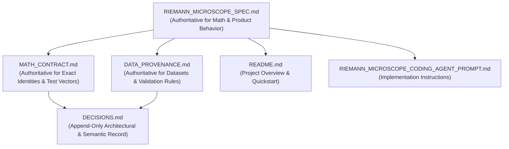

# Research Corpus Dependency Map

This map outlines the internal document authority hierarchy, mathematical dependency chains, and external source linkages.

## 1. Document Authority Hierarchy



## 2. Mathematical Dependency Chains

### A. Coordinate and Transformation Chain
```text
Constants (tau = 2*pi)
  │
  ├── Raw Coordinate s = sigma + i*t
  └── Centered Coordinate z = s - 1/2 = delta + i*t
        │
        ├── Camera Transform: T(s) = s
        ├── Height Microscope: s_K(u) = 1/2 + delta + i(t0 + tau^K * u)
        ├── Origin Dilation: s' = tau^K * s  ==>  Re(s') = tau^K / 2,  rho' = tau^K * rho
        ├── Centered Dilation: s' = 1/2 + tau^K(s - 1/2)  ==>  Re(s') = 1/2,  rho' = 1/2 + tau^K(rho - 1/2)
        ├── Argument Transform: f_K(s) = zeta(tau^K * s)  ==>  Re(s) = 1/(2*tau^K),  s_rho = rho / tau^K
        └── Kernel Lab: Z_{A,C,B,D}(s) = exp(-C(Bs+D)) * zeta(A(Bs+D))
              │
              ├── Inverse Scale Lock (AB = 1, C=D=0) ==> Z_{A,0,1/A,0}(s) = zeta(s)
              ├── Centered Mode Z_ctr(z) = zeta(1/2 + AB*z)
              └── Anisotropic Deformation (A_delta != A_gamma ==> Non-holomorphic)
```

### B. Centrifuge and Zero Character Chain
```text
Nontrivial Zero rho = 1/2 + delta + i*gamma
  │
  └── Character q_rho = tau^(rho - 1/2) = tau^delta * exp(i*gamma*log(tau))
        │
        ├── Modulus: |q_rho| = tau^delta
        ├── Grade K Amplification: q_rho^K = tau^(K*delta) * exp(i*K*gamma*log(tau))
        ├── Modulus under Grade K: |q_rho^K| = tau^(K*delta)
        ├── Log Modulus: log |q_rho^K| = K * delta * log(tau)
        ├── Derivative Slope: d/dK log |q_rho^K| = delta * log(tau)
        └── On-line Invariance: delta = 0 ==> |q_rho^K| = 1 for all K in R
```

### C. Explicit Formula and Prime Reconstruction Chain
```text
Nontrivial Zeros {rho_n} with 0 < Im(rho_n) <= T_N
  │
  ├── Riemann Prime-Power Explicit Formula:
  │     J_N(x) = Li(x) - 2 Re sum_rho Li(x^rho) - log(2) + int_x^infty du/[u(u^2-1)log u]
  │
  └── Möbius Inversion:
        pi_N(x) = sum_{m >= 1, x^(1/m) >= 2} (mu(m)/m) * J_N(x^(1/m))
        │
        ├── Benchmark comparison against deterministic prime sieve pi(x)
        └── Perturbation response: Delta C_n(x) = C(x, rho'_n) - C(x, rho_n)
```

### D. Zero Discovery vs Validation Independence Chain
```text
Critical Line Evaluation: Hardy Z(t) = exp(i*theta(t)) * zeta(1/2 + i*t)
  │
  ├── Step 1: Scan t-range for bracketed sign changes or near-zeros (Independent)
  ├── Step 2: High-precision root refinement (Newton / Brent / Arb ball enclosure)
  ├── Step 3: Verify residual |zeta(1/2 + i*gamma_found)| < epsilon
  └── Step 4: POST-DISCOVERY validation against external reference zeros (Odlyzko/LMFDB)
               (Reference table NEVER seeds discovery step)
```

## 3. External Mathematical Source Register

| Source / Reference | Role / Theorem Invoked | Applicable Corpus Domain | Verification Layer Support |
| :--- | :--- | :--- | :--- |
| **B. Riemann (1859)** | Functional equation $\xi(s)=\xi(1-s)$, Explicit formula for $J(x)$ | Panel C, Trust Tests | SymPy / Flint / Arb exact tests |
| **G. H. Hardy (1914)** | Hardy $Z$-function $Z(t)$, infinitely many zeros on $\Re(s)=1/2$ | Zero Finder, Panel B | `flint.acb` / `mpmath.siegelz` |
| **H. Davenport & H. Heilbronn (1936)** | Construction of zeta function with functional equation but off-line zeros | Falsification / Counterexample Control | `verify_counterexamples.py` |
| **A. Odlyzko / LMFDB** | High-precision computed zeros of $\zeta(s)$ on critical line | Reference validation data | `data/provenance.json` |
| **F. Johansson (Arb / python-flint)** | Rigorous ball arithmetic, certified bounds for $\zeta(s)$ | High-precision audit tier | `flint.acb` / `flint.arb` |
