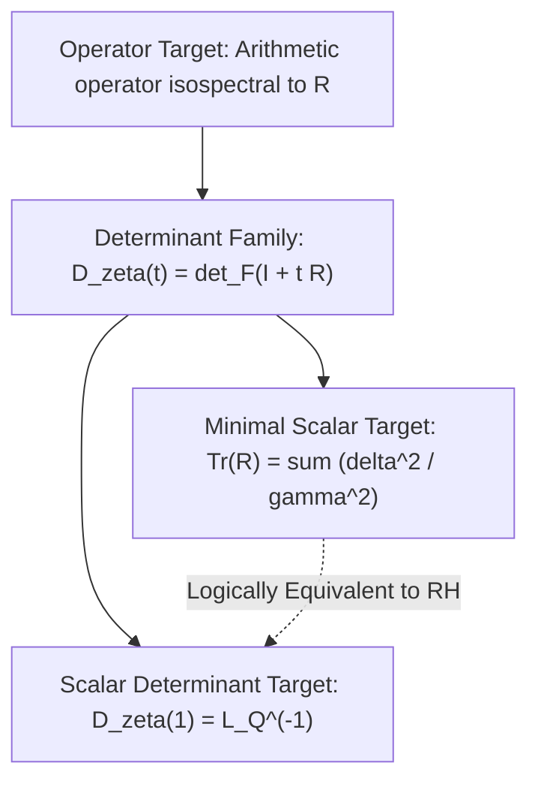

# Radial-Defect Quotient, Limiting Invariant \(L_Q\), and Relative Fredholm Theory

Canonical specification for the Radial-Defect Quotient \(Q(z)\), the limiting invariant \(L_Q\), the relative Fredholm determinant formulation, the scoped Projection Trap classification, and the reflection-paired kernel \(\kappa_1\).

---

## 1. Centered Coordinates and Reference Functions

Let the centered complex coordinate be

\[
\boxed{
z = s - \frac12 = \delta + it,
\qquad
s = \frac12 + z.
}
\]

Define the centered completed Riemann xi function:

\[
\boxed{
\Xi(z) = \xi\left(\frac12 + z\right),
}
\]

where \(\xi(s) = \frac12 s(s-1)\pi^{-s/2}\Gamma(s/2)\zeta(s)\) is the classical Riemann completed xi function.

The nontrivial zeros of \(\zeta(s)\) correspond to the centered zeros of \(\Xi(z)\):

\[
\rho = \frac12 + \lambda,
\qquad
\lambda = \delta + i\gamma.
\]

### Product Premises and Hadamard Factorization
1. **Exclusion of Real Nontrivial Zeros**: Since \(\zeta(s) \ne 0\) for \(s \in (0, 1)\), every nontrivial zero has non-zero imaginary coordinate \(\gamma = \Im \lambda \ne 0\).
2. **Paired Hadamard Factorization**: Because \(\Xi(z)\) is an entire function of order 1, \(\Xi(0) \ne 0\), and \(\Xi(-z) = \Xi(z)\) is even, its zeros pair symmetrically as \(\pm \lambda\). The genus-1 Hadamard product with symmetric \(\pm \lambda\) pairing takes the form:

\[
\boxed{
\Xi(z) = \Xi(0) \prod_{\lambda \in \Lambda^+} \left(1 - \frac{z^2}{\lambda^2}\right)^{m_\lambda},
}
\]

where \(\Lambda^+\) is the multiset of centered nontrivial zeros in the upper half-plane (\(\gamma > 0\)).

3. **General Multiplicity Formula**:
At each distinct zero height \(\gamma > 0\), the total zero multiplicity \(m_\gamma\) is:

\[
\boxed{
m_\gamma = m_{0,\gamma} + 2 \sum_{j} n_{j,\gamma},
}
\]

where:
- \(m_{0,\gamma} \ge 0\) is the multiplicity of on-line critical-line zeros at height \(\gamma\) (\(\delta = 0\));
- \(n_{j,\gamma} \ge 0\) is the multiplicity of off-line quartets in radial orbit \(j\) at height \(\gamma\) with displacement \(\delta_{j,\gamma} > 0\).

4. **Baseline Reference Function**:
Define the critical-line baseline reference function matching total zero multiplicity at each height \(\gamma > 0\):

\[
\boxed{
\Xi^\flat(z) = \prod_{\gamma > 0} \left(1 + \frac{z^2}{\gamma^2}\right)^{m_\gamma}.
}
\]

---

## 2. The Radial-Defect Quotient \(Q(z)\)

The Radial-Defect Quotient is defined as the normalized ratio of the actual completed function to the critical-line baseline reference:

\[
\boxed{
Q(z) = \frac{\Xi(z)}{\Xi(0) \Xi^\flat(z)}.
}
\]

For each on-line zero pair (\(\delta = 0\)), the factor \((1 + z^2/\gamma^2)^{m_{0,\gamma}}\) in \(\Xi(z)/\Xi(0)\) cancels identically with the corresponding factor in \(\Xi^\flat(z)\).

For each off-line quartet \(\{\pm\delta_j \pm i\gamma_j\}\) with multiplicity \(n_j\), the four zeros contribute to \(\Xi(z)/\Xi(0)\) the normalized factor:

\[
\left(1 - \frac{z}{\delta_j + i\gamma_j}\right)\left(1 - \frac{z}{-\delta_j + i\gamma_j}\right)\left(1 - \frac{z}{\delta_j - i\gamma_j}\right)\left(1 - \frac{z}{-\delta_j - i\gamma_j}\right)
=
\frac{(z^2 - (\delta_j+i\gamma_j)^2)(z^2 - (\delta_j-i\gamma_j)^2)}{(\delta_j^2+\gamma_j^2)^2}.
\]

Dividing by the corresponding baseline factor in \(\Xi^\flat(z)\), namely \((1 + z^2/\gamma_j^2)^2 = \frac{(z^2+\gamma_j^2)^2}{\gamma_j^4}\), yields the quartet quotient factor:

\[
\boxed{
Q_{\delta_j,\gamma_j}(z) = \frac{\gamma_j^4 \left[ (z^2 - \delta_j^2 + \gamma_j^2)^2 + 4\delta_j^2\gamma_j^2 \right]}{(\gamma_j^2+\delta_j^2)^2 (z^2+\gamma_j^2)^2}.
}
\]

The full quotient is therefore factored over all off-line radial orbits \(j\):

\[
\boxed{
Q(z) = \prod_{j} \left( Q_{\delta_j,\gamma_j}(z) \right)^{n_j}.
}
\]

---

## 3. Real-Axis Factor \(q_{\delta,\gamma}(x)\) and Audited Properties

Evaluating along the real centered axis \(z = x \in \mathbb R\) (corresponding to \(\Re(s) = 1/2 + x, \Im(s) = 0\)):

\[
\boxed{
q_{\delta,\gamma}(x) = \frac{\gamma^4 \left[ (x^2 + \gamma^2 - \delta^2)^2 + 4\delta^2\gamma^2 \right]}{(\gamma^2+\delta^2)^2 (x^2+\gamma^2)^2}.
}
\]

### Property 1: Boundedness and Positivity
\[
\boxed{
0 < q_{\delta,\gamma}(x) \le 1 \quad \forall x \in \mathbb R.
}
\]
Equality \(q_{\delta,\gamma}(x) = 1\) holds if and only if \(x = 0\) (when \(\delta \ne 0\)). If \(\delta = 0\), \(q_{0,\gamma}(x) \equiv 1\).

*Exact Defect Factorization*:
Subtracting \(q_{\delta,\gamma}(x)\) from 1 gives the exact algebraic factorization:

\[
\boxed{
1 - q_{\delta,\gamma}(x) = \frac{\delta^2 x^2 \left[(\delta^2 + 2\gamma^2)x^2 + 2\gamma^2(\delta^2 + 3\gamma^2)\right]}{(\delta^2+\gamma^2)^2 (x^2+\gamma^2)^2} \ge 0.
}
\]

Because \(\delta^2 \ge 0\) and \(\gamma > 0\), the numerator is strictly positive for all \(x \ne 0\) when \(\delta \ne 0\).

### Property 2: Extremum in \(u = x^2\) and Real Minimizers
In the variable \(u = x^2 \ge 0\), \(q(u)\) has a **unique minimum** at:

\[
\boxed{
u_* = \delta^2 + 3\gamma^2.
}
\]

Equivalently, along the real line \(x \in \mathbb R\), \(q_{\delta,\gamma}(x)\) has **two symmetric real minimizers** at:

\[
\boxed{
x = \pm \sqrt{\delta^2 + 3\gamma^2}.
}
\]

### Property 3: Exact Minimum Value
Writing the scale-invariant ratio \(r = \frac{\delta^2}{\gamma^2}\):

\[
\boxed{
q_{\min} = q_{\delta,\gamma}\left(\pm\sqrt{\delta^2+3\gamma^2}\right) = \frac{4}{(1+r)^2(4+r)}.
}
\]

### Property 4: Exact Uniform Domination Estimate
\[
\boxed{
\sup_{x\in\mathbb R} |\log q_{\delta,\gamma}(x)| = 2\log(1+r) + \log\left(1 + \frac{r}{4}\right) \le \frac{9}{4}r.
}
\]
*Significance*: Because \(\sum_{j} n_j \frac{\delta_j^2}{\gamma_j^2} < \infty\), the bound \(\frac{9}{4}\frac{\delta^2}{\gamma^2}\) provides the uniform domination necessary for absolute and uniform convergence and limit/product interchange.

---

## 4. The Limiting Invariant \(L_Q\) and Spectral Equivalence

Taking the asymptotic limit as \(x \to \infty\) along the real centered axis:

\[
\lim_{x\to\infty} q_{\delta,\gamma}(x) = \frac{\gamma^4}{(\gamma^2+\delta^2)^2} = \left(\frac{\gamma^2}{\gamma^2+\delta^2}\right)^2 = (1+r)^{-2}.
\]

Therefore, the limiting invariant indexed over all off-line radial orbits \(j\) is:

\[
\boxed{
L_Q = \lim_{x\to\infty} Q(x) = \prod_{j} \left(\frac{\gamma_j^2}{\gamma_j^2+\delta_j^2}\right)^{2n_j} = \prod_j (1 + r_j)^{-2n_j}.
}
\]

### Spectral Equivalence
\[
\boxed{
0 < L_Q \le 1,
\qquad
L_Q = 1 \iff \mathrm{RH}.
}
\]

> [!IMPORTANT]
> \(L_Q = 1 \iff \mathrm{RH}\) is an exact **spectral equivalence**. It is not an arithmetic proof of RH, because evaluating \(L_Q\) directly from \(Q(x)\) requires knowledge of the zero divisor.

---

## 5. Exact Relationship to EF-013 and Audited Withdrawal

Define the single-zero radial defect:

\[
\boxed{
d(\delta,\gamma) = \log\left(1 + \frac{\delta^2}{\gamma^2}\right).
}
\]

For the test function \(H(z) = \log z\), the projection-subtracted quartet response is:

\[
2\Re\log(\delta+i\gamma) - 2\Re\log(i\gamma) = \log(\delta^2+\gamma^2) - \log(\gamma^2) = \log\left(1 + \frac{\delta^2}{\gamma^2}\right) = d(\delta,\gamma).
\]

Thus, the \(L_Q\) defect already lies inside the projection-subtracted EF-013 construction:

\[
-\log L_Q = 2 \sum_{j} n_j d(\delta_j,\gamma_j).
\]

### Reasons for Bridge Failure
The failure of EF-013 to provide an arithmetic proof of RH stems from three distinct causes:
1. **Test-Class Inadmissibility**: \(H(z) = \log z\) is outside the admissible Riemann–Weil test class due to its logarithmic branch point at \(z=0\), growth at infinity, and test-domain restrictions.
2. **The Projected-Divisor Problem**: The subtraction \(2\Re\log(i\gamma)\) is evaluated on the projected divisor \(\mathcal P_0(\mathcal D_\zeta)\), which has no established independent arithmetic representation.
3. **Finite Non-Compensation**: Finite basis non-compensation (EF-016) was not established across the full zero spectrum.

### Audited Withdrawal
> [!NOTE]
> The historical conjecture that EF-013 had the "wrong \(\gamma\)-curvature" was audited and found to be incorrect: \(H(z)=\log z\) yields exactly the curvature \(d(\delta,\gamma)\). The claim of wrong \(\gamma\)-curvature is **withdrawn** (`WDR-001`) and preserved in the ledger with its mathematical justification.

---

## 6. Scoped Classification of the Projection Trap (EF-018 / OBL-EF-003)

### The Scoped One-Point No-Go Theorem

Let \(H\) be a holomorphic test function defined on a vertical strip containing the critical strip, and let \(G = H + H \circ (-\mathrm{id})\) be the symmetrized even holomorphic function.

The quartet response of \(H\) across a symmetric configuration at \(z = \delta + i\gamma\) is:

\[
A_H(\delta, \gamma) = 2 \Re G(\delta + i\gamma).
\]

**Theorem (Scoped One-Point No-Go)**:
If \(A_H(\delta, \gamma)\) is independent of \(\delta\) on an open displacement interval \(I \ni 0\) for each \(\gamma\) in an open interval, then \(G(z)\) is identically constant on its domain of holomorphy.

*Proof*:
Write \(G(u + iv) = U(u,v) + iV(u,v)\) in real and imaginary parts. Then \(A_H(\delta, \gamma) = 2 U(\delta, \gamma)\).
The hypothesis that \(A_H(\delta, \gamma)\) is independent of \(\delta\) implies:

\[
\frac{\partial U}{\partial u}(\delta, \gamma) = 0
\]

identically on an open set \(I \times J \subset \mathbb R^2\).
By the Cauchy-Riemann equations for the holomorphic function \(G\):

\[
\frac{\partial V}{\partial v} = \frac{\partial U}{\partial u} = 0,
\qquad
\frac{\partial V}{\partial u} = -\frac{\partial U}{\partial v}.
\]

Differentiating \(\frac{\partial U}{\partial u} = 0\) with respect to \(v\) yields \(\frac{\partial^2 U}{\partial v \partial u} = 0\), which together with harmonicity \(\frac{\partial^2 U}{\partial u^2} + \frac{\partial^2 U}{\partial v^2} = 0\) and \(\frac{\partial U}{\partial u} = 0\) implies \(\frac{\partial^2 U}{\partial v^2} = 0\).
Therefore \(\frac{\partial U}{\partial v}\) is constant. Since \(G\) is even, \(U(u,v) = U(-u, -v)\), which forces \(\frac{\partial U}{\partial v}(0,0) = 0\), so \(\frac{\partial U}{\partial v} = 0\) everywhere.
Thus \(G'(z) = \frac{\partial U}{\partial u} - i\frac{\partial U}{\partial v} = 0\) on an open connected domain, forcing \(G(z) \equiv C\) to be constant. \(\blacksquare\)

### Method-Class Boundaries

\[
\boxed{
\begin{aligned}
\textbf{CLOSED:}&\ \text{For fixed linear combinations of direct one-point holomorphic} \\
&\ \text{Riemann–Weil statistics over an open displacement family, and locally} \\
&\ \text{uniform limits of such linear combinations.} \\
\textbf{OPEN:}&\ \text{For nonlinear paired, sesquilinear, determinantal, operator, or} \\
&\ \text{independently constructed zeta-divisor-specific comparison objects.}
\end{aligned}
}
\]

---

## 7. Relative Fredholm Formulation

Define the positive diagonal trace-class spectral operator \(\mathcal R\) on the Hilbert space \(\ell^2(\Lambda^+)\) of upper-half-plane zeros:

\[
\boxed{
\mathcal R e_\lambda = \frac{\delta_\lambda^2}{\gamma_\lambda^2} e_\lambda,
\qquad
\lambda = \delta_\lambda + i\gamma_\lambda \in \Lambda^+.
}
\]

(For critical-line zeros \(\delta_\lambda = 0\), the diagonal entry is 0).

### Properties:
1. **Positivity**: \(\mathcal R \ge 0\).
2. **Trace Class**: Because \(\sum_\lambda \frac{1}{\gamma_\lambda^2} < \infty\) and \(|\delta_\lambda| < 1/2\):
   \[
   \operatorname{Tr}\mathcal R = \sum_{\lambda\in\Lambda^+} \frac{\delta_\lambda^2}{\gamma_\lambda^2} < \infty.
   \]
3. **Fredholm Determinant**:
   \[
   \boxed{
   \det_{\mathrm F}(I + \mathcal R) = \prod_{\lambda\in\Lambda^+} \left(1 + \frac{\delta_\lambda^2}{\gamma_\lambda^2}\right) = L_Q^{-1}.
   }
   \]
4. **Logarithmic Determinant**:
   \[
   \boxed{
   -\log L_Q = \operatorname{Tr}\log(I + \mathcal R) = \log\det_{\mathrm F}(I + \mathcal R).
   }
   \]
5. **RH Equivalence**:
   \[
   \boxed{
   \operatorname{Tr}\mathcal R = 0 \iff \mathcal R = 0 \iff \mathrm{RH},
   \qquad
   \det_{\mathrm F}(I + \mathcal R) = 1 \iff \mathrm{RH}.
   }
   \]

> [!CAUTION]
> Do not decompose \(\log\det_{\mathrm F}(I+\mathcal R)\) into divergent raw sums such as \(\sum \log|z| - \sum \log|\Im z|\). The relative determinant is the canonical, unconditionally convergent object.

---

## 8. Target Hierarchy

The target representations for an arithmetic bridge are structured hierarchically:

1. **Minimal Scalar Target**: \(\operatorname{Tr}\mathcal R = \sum \frac{\delta^2}{\gamma^2}\). Vanishing is already RH-equivalent. Structurally simpler than the determinant, but logically equivalent.
2. **Scalar Determinant Target**: \(D_\zeta(1) = \det_{\mathrm F}(I+\mathcal R) = L_Q^{-1}\).
3. **Full Determinant Family**: \(D_\zeta(t) = \det_{\mathrm F}(I + t\mathcal R) = \exp\left(\sum_{k\ge 1} \frac{(-1)^{k+1}}{k} t^k \operatorname{Tr}\mathcal R^k\right)\). Near \(t=0\), generates all trace moments \(\operatorname{Tr}\mathcal R^k\).
4. **Operator Target**: An arithmetic operator sharing the non-zero spectrum of \(\mathcal R\) with multiplicity (literal equality of operators is unnecessary; isospectral realization suffices).

---

## 9. Immediate Live Research Kernel: Reflection-Paired \(\kappa_1\)

For centered coordinates \(z = \delta + i\gamma\), define the involution:

\[
\boxed{
z^\# = -\bar z = -\delta + i\gamma.
}
\]

Define the rational pairing kernel:

\[
\boxed{
\kappa_1(z,w) = \frac{4zw}{(z+w)^2} - 1.
}
\]

### Exact Involution Identity
Evaluating \(\kappa_1\) on the pair \((z, z^\#)\):

\[
z + z^\# = (\delta + i\gamma) + (-\delta + i\gamma) = 2i\gamma \implies (z + z^\#)^2 = -4\gamma^2.
\]
\[
z z^\# = (\delta + i\gamma)(-\delta + i\gamma) = -\delta^2 + i\delta\gamma - i\delta\gamma - \gamma^2 = -(\delta^2+\gamma^2).
\]
\[
\kappa_1(z, z^\#) = \frac{4(-(\delta^2+\gamma^2))}{-4\gamma^2} - 1 = \frac{\delta^2+\gamma^2}{\gamma^2} - 1 = \frac{\delta^2}{\gamma^2}.
\]

\[
\boxed{
\kappa_1(\lambda, \lambda^\#) = \frac{\delta^2}{\gamma^2}.
}
\]

Therefore, the relative trace is:

\[
\boxed{
\operatorname{Tr}\mathcal R = \sum_{\lambda\in\Lambda^+} \kappa_1(\lambda, \lambda^\#).
}
\]

### The Open Research Theorem (OBL-RDQ-001)
\[
\boxed{
\text{Can a divisor-independent arithmetic construction isolate the } (\lambda, \lambda^\#) \text{ pairs and evaluate } \kappa_1?
}
\]

- The functional equation \(\xi(s) = \xi(1-s) \iff \Xi(z) = \Xi(-z)\) supplies closure under the involution \(z \mapsto -z\).
- The Schwarz reflection \(\overline{\Xi(z)} = \Xi(\bar z)\) supplies closure under \(z \mapsto \bar z\).
- Together they supply closure under \(z \mapsto z^\# = -\bar z\).
- **The unresolved problem**: Isolating the correct pairs \((\lambda, \lambda^\#)\) without reading the divisor directly.

---

## 10. Transcendental Continuation and Grade Covariance

1. **Radial Class Preservation**: Transcendental continuation \(\mathcal X_\tau(s,k) = \xi(\tau^{-k}s)\) transports zero worldlines \(s_\rho(k) = \tau^k\rho\) while preserving normalized radial coordinate \(R_\tau \equiv \delta\).
2. **Grade-Indexed Covariance of \(Q\)**:
   - Under coordinate dilation at grade \(K\), \(s_K = \tau^K s \implies z_K = \tau^K z\).
   - The grade-\(K\) quotient \(Q_K(z_K) = \frac{\Xi_K(z_K)}{\Xi_K(0)\Xi_K^\flat(z_K)}\) satisfies the exact covariance relation:
     \[
     \boxed{
     Q_K(z_K) = Q_0(\tau^{-K} z_K),
     \qquad
     Q_K(\tau^K z) = Q_0(z).
     }
     \]
3. **Grade Invariance of Spectrum and Limits**:
   - Under uniform dilation \((x, \delta, \gamma) \mapsto (\tau^K x, \tau^K \delta, \tau^K \gamma)\), the dimensionless ratios \(x/\gamma\) and \(\delta/\gamma\) are strictly invariant.
   - Consequently, the limiting invariant \(L_Q = \lim_{x\to\infty} Q_0(x) = \lim_{x_K\to\infty} Q_K(x_K)\), the displacement spectrum \(\{r_\lambda = \delta_\lambda^2/\gamma_\lambda^2\}\), and the spectral operator trace \(\operatorname{Tr}\mathcal R\) are **strictly grade-invariant**.
4. **Rigidity Requirement**: Coordinate grade dilation does not supply the rigidity law. The rigidity source must contain additional zeta-specific arithmetic content (the Euler product / prime structure).
