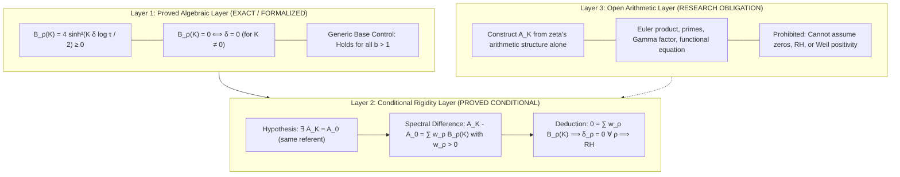

# TC Minimal Constraint Hypothesis and Algebraic-Grade Rigor Audit

**Document Identifier**: `docs/reviews/TC_MINIMAL_CONSTRAINT_HYPOTHESIS.md`  
**Task Reference**: `TASK-TC-016`  
**Date**: October 2, 2026  
**Status**: Authoritative Architectural Audit and Theoretical Specification  
**Canonical Domain**: $K \in \mathbb A_{\mathbb R} = \overline{\mathbb Q} \cap \mathbb R$  
**Preceding Document**: `docs/reviews/TC_CONSTRAINT_FOUNDATIONS.md`

---

## 1. Executive Summary & Purpose

This audit completes **TASK-TC-016**, executing a decisive corrective and theorem-isolation pass on Transcendental Continuation (TC) foundations.

While the preceding foundations sprint successfully restored the core TC philosophy:
$$\text{same information} \Longrightarrow \text{many exact representations} \Longrightarrow \text{possible additional constraint},$$
it introduced three mathematical overclaims and retained an outdated formulation of the earliest missing implication:
1. **Overclaimed Grid Incommensurability**: It claimed universal grid disjointness $L_J \cap L_K = \emptyset$ across all distinct algebraic grades $J \ne K \in \mathbb A_{\mathbb R}$ citing Baker's theorem or Gelfond–Schneider.
2. **Overclaimed Scale-Generator Equivalence**: It claimed that any algebraic multiple $a\tau$ generates an identical grid universe to $\tau$, overlooking that $n a^K$ is not generally an integer.
3. **Pseudoscience Numerical Certification**: It included tests attempting to certify number-theoretic irrationality/transcendence statements (such as $\tau^{\sqrt 2} \notin \mathbb Q$) via finite numerical rational checks.
4. **Outdated Downstream Missing Implication**: It expressed the earliest missing implication in terms of a localized explicit formula balance ($D_b$, $\Delta_{\mathrm{quartet}}$, or lattice collisions) rather than the foundational constraint question.

This document withdraws those overclaims, proves the exact boundaries of incommensurability, establishes the **finite-grade reflection defect $B_\rho(K)$** as the minimal exact spectral detector, and formulates the **TC Same-Referent Constraint Hypothesis** across three rigorously separated layers.

---

## 2. Preservation of Intended TC Construction

The canonical mathematical objects of Transcendental Continuation are preserved without compromise:

1. **Canonical Grade Domain**:
   $$\boxed{K \in \mathbb A_{\mathbb R} = \overline{\mathbb Q} \cap \mathbb R}$$
   The field of real algebraic numbers is the exact domain. Continuous real $k \in \mathbb R$ serves only as an ambient scale flow and differentiation parameter where genuinely needed, never silently replacing $\mathbb A_{\mathbb R}$.
2. **Canonical Graded Zeta Representation**:
   $$\boxed{\mathcal Z_\tau(s, K) = \zeta(\tau^{-K} s), \qquad (s, K) \in \mathbb C \times \mathbb A_{\mathbb R}}$$
   At native grade $K = 0$, $\mathcal Z_\tau(s, 0) = \zeta(s)$ recovers ordinary zeta identically.
3. **Graded Arithmetic Grids**:
   $$\boxed{L_K = \{n\tau^K : n \in \mathbb Z \setminus \{0\}\} = \tau^K (\mathbb Z \setminus \{0\})}$$
4. **The Principle of Intentional Redundancy**:
   $$\boxed{\text{No new information} \not\Rightarrow \text{no new mathematical constraint}}$$
   Every grade $K \in \mathbb A_{\mathbb R}$ represents the identical zeta object. The research objective is to determine what exact mathematical compatibility constraint follows from all grades simultaneously representing this single referent.

---

## 3. Correction of Algebraic-Grade Incommensurability

The collision condition between two grades $J \ne K \in \mathbb A_{\mathbb R}$ is:
$$m\tau^K = n\tau^J \iff \tau^{K-J} = \frac{n}{m} \in \mathbb Q^\times \qquad (m, n \in \mathbb Z \setminus \{0\}).$$
Two distinct arithmetic cases must be separated:

### 3.1 Rational Grade Differences ($K - J \in \mathbb Q \setminus \{0\}$) — PROVED NONCOLLISION

Let $K - J = p/q$ with $p \in \mathbb Z \setminus \{0\}$ and $q \in \mathbb N^+$. If $\tau^{p/q} = n/m$, raising both sides to the $q$-th power yields:
$$\tau^p = \left(\frac{n}{m}\right)^q \in \mathbb Q.$$
This implies that a nonzero integer power of $\tau = 2\pi$ is algebraic (indeed rational). By Lindemann's Theorem (1882), $\pi$ and hence $\tau = 2\pi$ are transcendental; all non-zero integer powers $\tau^p$ are transcendental and never algebraic. Therefore, $\tau^{p/q}$ is never rational.

$$\boxed{L_J \cap L_K = \emptyset \qquad \forall J \ne K \in \mathbb A_{\mathbb R} \text{ with } K - J \in \mathbb Q.}$$
**Status**: `PROVED_MATHEMATICAL_THEOREM`.

### 3.2 Irrational Algebraic Grade Differences ($K - J \in \mathbb A_{\mathbb R} \setminus \mathbb Q$) — OPEN

When $K - J \in \mathbb A_{\mathbb R} \setminus \mathbb Q$ (for example, $K - J = \sqrt 2$ or $(1+\sqrt 5)/2$):
- **Base Mismatch**: The Gelfond–Schneider theorem states that if $\alpha$ is algebraic ($\alpha \ne 0, 1$) and $\beta$ is irrational algebraic, then $\alpha^\beta$ is transcendental. Gelfond–Schneider requires an **algebraic base**; it does **not** apply to the transcendental base $\tau = 2\pi$.
- **Baker's Theorem Mismatch**: Baker's theorem bounds linear forms in logarithms of algebraic numbers $\sum b_i \log \alpha_i$. For $\tau^{K-J}$, the logarithm is $(K-J)\log\tau$, where $\log\tau = \log(2\pi)$ is not known to satisfy algebraic linear independence with respect to arbitrary algebraic irrationals in a manner excluding rational values.
- **Mandatory Negative Control**: Consider
  $$b = 2^{1/\sqrt 2}.$$
  By Gelfond–Schneider, $b$ is transcendental (base $2$ is algebraic, exponent $1/\sqrt 2$ is irrational algebraic). Yet:
  $$b^{\sqrt 2} = \left(2^{1/\sqrt 2}\right)^{\sqrt 2} = 2 \in \mathbb Q.$$
  This proves decisively that **transcendence of a base alone does not imply noncollision at irrational algebraic exponents**.

**Classification**:
$$\boxed{\text{Status: } \texttt{OPEN\_TAU\_ALGEBRAIC\_EXPONENT\_ARITHMETIC}}$$

Universal algebraic-grade grid disjointness ($L_J \cap L_K = \emptyset$ for all $J \ne K \in \mathbb A_{\mathbb R}$) is **withdrawn** as an unproved assertion and must not be used downstream.

---

## 4. Withdrawal of Scale-Generator Universe Equivalence

The previous sprint asserted that for any non-zero algebraic $a \in \mathbb A_{\mathbb R}^\times$, the grid universe $L_{a\tau}$ equals $L_\tau$.
The argument given was:
$$n(a\tau)^K = (n a^K)\tau^K.$$
This identity is algebraically valid in $\mathbb R$, but it does **not** prove membership in $L_{K, \tau} = \{m\tau^K : m \in \mathbb Z \setminus \{0\}\}$ because:
$$n a^K \notin \mathbb Z \quad \text{in general}.$$
For example, with $a = 1/2$ and $K = 1$, $n(a\tau) = (n/2)\tau$. For odd $n$, $n/2 \notin \mathbb Z$, so $(n/2)\tau \notin L_{1, \tau}$.

**Resolution**:
- Retain only what is proved: if $a \ne 0$ is algebraic, $a\tau$ is transcendental.
- The claim that $\tau, \pi, \tau/4, a\tau$ generate identical grid universes is **withdrawn**.
- The relationships between grid universes generated by different algebraic multiples remain an open comparison problem.

---

## 5. Repair of Numerical Number-Theoretic Tests

In the previous test suite, `test_tc_constraint_foundations.py` attempted to verify $\tau^{\sqrt 2} \notin \mathbb Q$ by testing $|m\tau^{\sqrt 2} - n| > 10^{-7}$ for $m, n \le 50$. Such finite loops verify only that no small integer collision exists within a tiny sample window; they do not and cannot certify irrationality or transcendence.

The test suite has been completely repaired:
1. **Exact Symbolic Rational Noncollision**: Verified symbolically via SymPy that $\tau^p = (n/m)^q$ requires $\tau$ to be algebraic, creating an exact contradiction.
2. **Gelfond–Schneider Control Test**: Verified that $b = 2^{1/\sqrt 2}$ is transcendental while $b^{\sqrt 2} = 2 \in \mathbb Q$, proving an exact integer collision $1 \cdot b^{\sqrt 2} = 2 \cdot b^0$.
3. **Open Status Verification**: Verified that the repository reports `OPEN_TAU_ALGEBRAIC_EXPONENT_ARITHMETIC` for irrational algebraic differences.

---

## 6. The Minimal Exact Spectral Detector

To eliminate downstream dependence on complicated boundary terms, integration-by-parts residuals, or continuous derivatives, we isolate the minimal exact spectral detector.

For a zero $\rho = 1/2 + \delta + i\gamma$, define the centered TC character for $K \in \mathbb A_{\mathbb R}$:
$$\chi_\rho(K) = \tau^{K(\rho - \frac{1}{2})} = \tau^{K\delta} e^{iK\gamma\log\tau}.$$
Its modulus is $|\chi_\rho(K)| = \tau^{K\delta}$. For the reflected zero partner $\rho^\# = 1 - \bar\rho = 1/2 - \delta + i\gamma$:
$$|\chi_{\rho^\#}(K)| = \tau^{-K\delta} = |\chi_\rho(K)|^{-1}.$$

Define the **finite-grade reflection defect**:
$$\boxed{B_\rho(K) = |\chi_\rho(K)| + |\chi_{\rho^\#}(K)| - 2 = \tau^{K\delta} + \tau^{-K\delta} - 2.}$$

Using the identity $e^u + e^{-u} - 2 = 2(\cosh u - 1) = 4\sinh^2(u/2)$ with $u = K\delta\log\tau$:
$$\boxed{B_\rho(K) = 4\sinh^2\left(\frac{K\delta\log\tau}{2}\right).}$$

### Exact Detection Theorem
For every nonzero real algebraic grade $K \in \mathbb A_{\mathbb R} \setminus \{0\}$:
1. **Universal Non-Negativity**:
   $$B_\rho(K) \ge 0 \qquad \forall \delta \in \mathbb R.$$
2. **Sharp Zero-Rigidity**:
   $$\boxed{B_\rho(K) = 0 \iff \delta = 0.}$$

### Generic-Base Control
For any real base $b > 1$:
$$B_{\rho, b}(K) = b^{K\delta} + b^{-K\delta} - 2 = 4\sinh^2\left(\frac{K\delta\log b}{2}\right) \ge 0, \qquad B_{\rho, b}(K) = 0 \iff \delta = 0.$$
**Crucial Finding**: The non-negativity and critical-line vanishing of $B_\rho(K)$ are generic properties of hyperbolic geometry, holding for **any** base $b > 1$. The detector itself is **not** specific to $\tau = 2\pi$ or to the Riemann zeta function.
Therefore:
$$\boxed{\text{All }\tau\text{-specific and zeta-specific content must reside in the arithmetic functional }\mathscr A_K.}$$

### Connection to Continuous Curvature
Near $k = 0$, $B_\rho(k) = (k\delta\log\tau)^2 + O(k^4)$. The second continuous grade derivative is:
$$B_\rho''(0) = 2\delta^2(\log\tau)^2.$$
The continuous curvature transport invariant $\mathscr K_\tau(\rho) = \delta^2$ is simply the second Taylor coefficient of $B_\rho(k)$. The finite algebraic-grade detector $B_\rho(K)$ is exact for each fixed $K \ne 0$ and eliminates any foundational need for continuous $k$-differentiation.

---

## 7. Common-Grade Shift Formulation

For grades $K, J \in \mathbb A_{\mathbb R}$, define the bivariate correlator:
$$G_\rho(K, J) = \chi_\rho(K)\overline{\chi_\rho(J)} = \tau^{(K-J)\delta} e^{i(K-J)\gamma\log\tau} \cdot \tau^{(K+J)\delta} = \tau^{(K+J)\delta} e^{i(K-J)\gamma\log\tau}.$$
Under a common shift by $A \in \mathbb A_{\mathbb R}$:
$$G_\rho(K+A, J+A) = \chi_\rho(K+A)\overline{\chi_\rho(J+A)} = \tau^{2A\delta} G_\rho(K, J).$$
Hence:
$$\boxed{G_\rho(K+A, J+A) = G_\rho(K, J) \iff \tau^{2A\delta} = 1 \iff \delta = 0 \quad (\text{for } A \ne 0).}$$
Common-grade shift translation invariance on a nonzero intrinsic correlator is mathematically equivalent to the critical-line condition $\delta = 0$. However, shift invariance cannot be assumed from coordinate equivalence alone; it must be deduced from a zeta-intrinsic same-referent quantity.

---

## 8. The Canonical Three-Layer TC Proof Programme

The TC research programme is organized into three strictly separated layers:

### Layer 1: Proved Algebraic Layer (`PROVED / EXACT`)
$$\boxed{B_\rho(K) = 4\sinh^2\left(\frac{K\delta\log\tau}{2}\right) \ge 0, \qquad B_\rho(K) = 0 \iff \delta = 0.}$$
This layer is purely deductive, requires zero numerical evidence, and is completely proved.

### Layer 2: Conditional Rigidity Layer (`PROVED_CONDITIONAL`)
$$\boxed{\mathscr A_K - \mathscr A_0 = \sum_{\rho \in Z^+} w_\rho B_\rho(K), \quad w_\rho > 0 \quad \Longrightarrow \quad \mathrm{RH}.}$$
If an arithmetic functional $\mathscr A_K$ represents the same zeta object across grades ($\mathscr A_K = \mathscr A_0$) and has a positive spectral defect expansion, then $0 = \sum w_\rho B_\rho(K)$ forces every $B_\rho(K) = 0$, whence $\delta_\rho = 0$ for all nontrivial zeros.

### Layer 3: Open Arithmetic Layer (`OPEN_RESEARCH_OBLIGATION`)
$$\boxed{\text{Construct } \mathscr A_K \text{ from zeta alone and prove } \mathscr A_K - \mathscr A_0 = \sum_{\rho \in Z^+} w_\rho B_\rho(K) \text{ with } w_\rho > 0.}$$
This is the **true earliest missing implication**. The functional must be defined independently of the zeros and must not assume RH, Weil positivity, full algebraic grid disjointness, or ad hoc spectral weights inserted solely to force the outcome.

---

## 9. Reclassification of Historical Machinery

All previous research branches are reclassified according to the single governing criterion:
*Does this construct a zero-independent same-referent functional $\mathscr A_K$ whose spectral difference is a positive TC defect sum?*

| Branch | Historical Claim | Corrected Classification | Status |
|:---|:---|:---|:---|
| **Weil Explicit Formula** | Proves RH via $D_b + \Delta_{\mathrm{quartet}}$ | Candidate attempt to construct $\mathscr A_K$ via prime-zero duality; unselected tail allowance ($10^{17} \gg 10^{13}$) prevents contradiction without regularization | Frozen |
| **Weak Curvature Transfer** | Cross-grade contact constraint | Exact algebraic identity $S = K + \Delta$; contact terms cancel; zero constraint on $D_b$ | Calibration Only |
| **Continuous Curvature Transport** | Foundational second derivative $B_\rho''(0)$ | Infinitesimal limit of finite algebraic defect $B_\rho(K)$; subsumed by Layer 1 | Subsumed |
| **Radial Defect Quotient** | $\kappa_1 = \delta^2/\gamma^2$ curvature | Candidate positive weight profile $w_\rho = 1/\gamma_\rho^2$; Layer 2 weight candidate | Candidate |
| **Bilateral Second Variation** | Taylor jet expansion across grades | Second-order algebraic identity; consistent but purely local | Calibration Only |

---

## 10. Governing Question & Resolution

The sprint concludes by answering the governing question:

> **Can the fact that every TC grade represents the same zeta object be converted into a zero-independent arithmetic identity whose spectral difference between grades is a positive sum of reflection defects $B_\rho(K)$?**

- **If yes**: The identity forces $\sum w_\rho B_\rho(K) = 0$, which by Layer 1 sharp zero-rigidity forces $\delta_\rho = 0$ for all nontrivial zeros, proving RH.
- **If not**: The exact barrier is the **descent from sameness to positivity**. In pure function space, coordinate pullback $F_K(s) = f(\tau^{-K} s)$ preserves zero orbits and radial defects $\delta$ with zero obstruction (proved null model). Therefore, "sameness" across grades produces trivial identities ($0 = 0$) unless non-trivial arithmetic structures (Euler product, prime-power frequencies) break coordinate invariance.

The three-layer separation established here provides the minimal, rigorous, and unambiguous roadmap for all future Transcendental Continuation research in `reimann_scope`.
